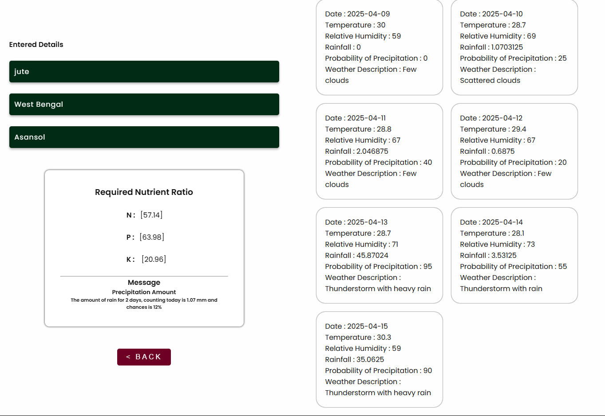
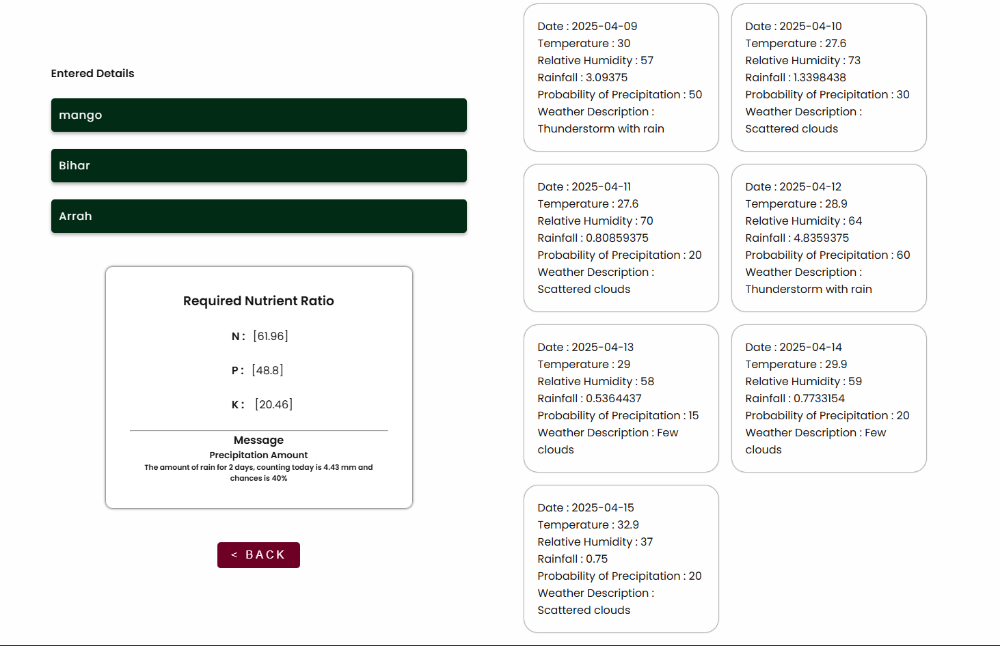
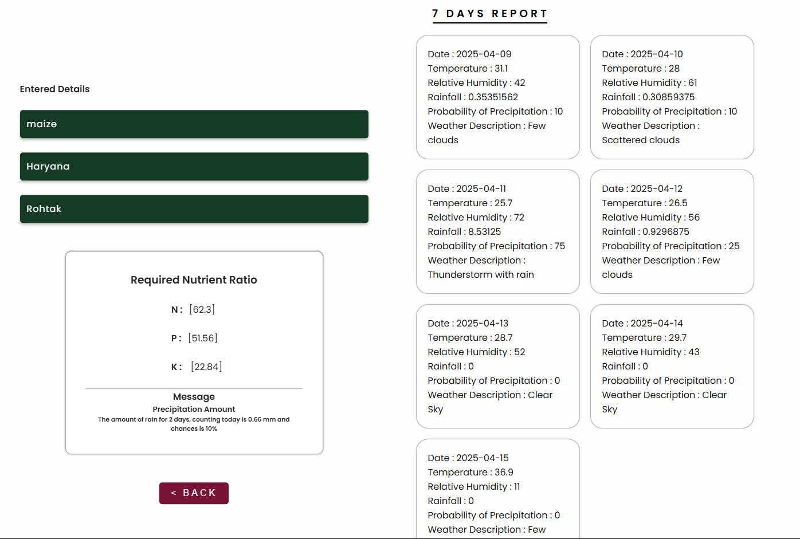
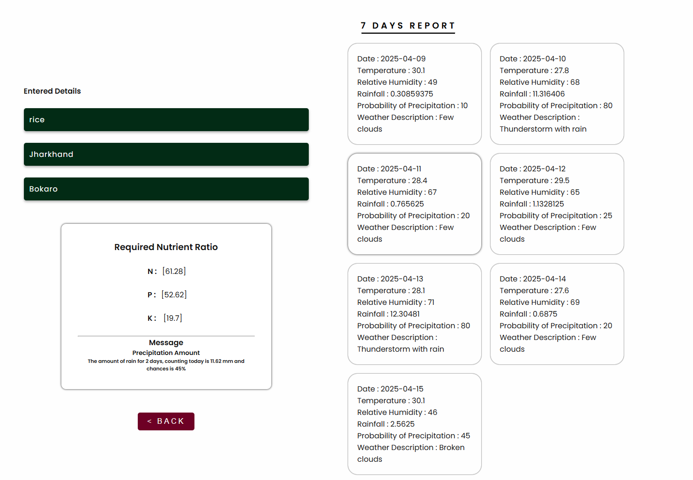
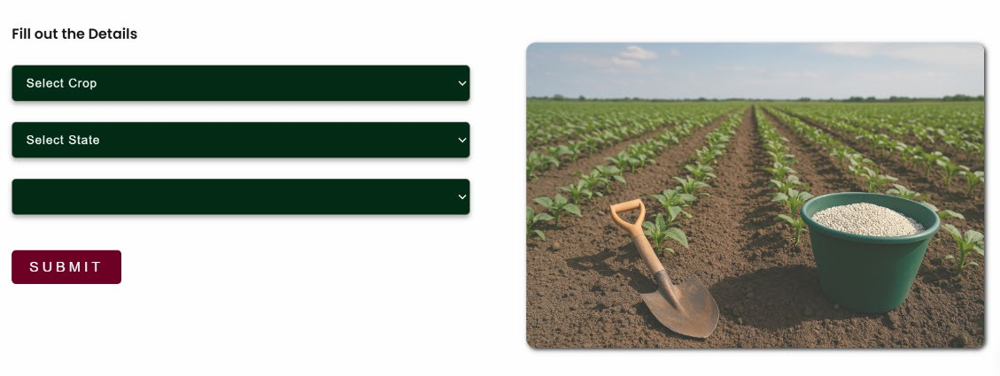

# 🌱 AgroClimate‑Driven Fertilizer Recommendation 🚜

## 📘 Abstract
Fertilizer usage is often limited by farmers’ awareness. To maximize yield and reduce nutrient loss, targeted recommendations are essential. Rainfall intensity also affects soil nutrient dynamics—optimal rainfall enhances nutrient absorption, but heavy rain leads to runoff.  

This project uses a **time‑series Random Forest model** to analyze rainfall and fertility patterns and recommend tailored N:P:K (Nitrogen, Phosphorus, Potassium) doses for crops. The result: improved yields, minimized runoff, and sustainable fertilizer use.

---

## 🧰 Required Tools & Libraries
- Python 3.8+
- Flask
- Libraries:
  - pandas, numpy, scikit-learn
  - category_encoders
  - matplotlib
  - requests
- A modern web browser

Install with:
```bash
pip install flask pandas numpy scikit-learn category_encoders matplotlib requests
```

---

## 🧩 Version Info

| Library             | Version |
|---------------------|---------|
| Python              | 3.8.10  |
| Flask               | 2.1.2   |
| pandas              | 1.3.3   |
| numpy               | 1.22.3  |
| scikit-learn        | 1.0.2   |
| category_encoders   | 2.5.0   |
| matplotlib          | 3.4.3   |
| requests            | 2.27.1  |

---

## 🚀 How to Run

```bash
# 1. Clone the repo
git clone https://github.com/kmanishprogrammar/AgroClimate-Driven-Fertilizer-Recommendation.git
cd AgroClimate-Driven-Fertilizer-Recommendation

# 2. Install dependencies
pip install -r requirements.txt

# 3. Run the Flask web app
python app.py
```

Then open your browser and go to `http://127.0.0.1:5000` to access the application.

---

## 📸 Sample Output

<p align="center">
  
  
  
  
  
  
  
  
  
</p>


*Above: The app displays recommended N:P:K values along with a seven‑day weather forecast*

---

## ✅ Features
- 📈 Predicts N:P:K fertilizer recommendations using rainfall and climate data  
- 🎯 Time‑series analysis with Random Forest models  
- 📊 Displays seven-day weather forecast  
- 🔧 Easy-to-use web interface built with Flask  

---

## 📚 Key Learnings
- Integrating time-series and weather data for agronomic prediction  
- Handling categorical and numerical features with encoding/scaling  
- Model training, evaluation, and export pipeline  
- Simple and effective Flask-based front-end deployment  

---

## 🧑‍💻 Author
**Manish Kumar**  
📧 [kmanishprogrammar@gmail.com](mailto:kmanishprogrammar@gmail.com)  
🔗 [GitHub](https://github.com/kmanishprogrammar)  
🔗 [LinkedIn](https://www.linkedin.com/in/manish-kumar-921111256)

---

## 📝 License
This project is for educational and demonstration purposes.  
Feel free to fork or adapt with attribution.

---

## 🙏 Acknowledgements
- Open-source data science ecosystem: pandas, scikit‑learn, Flask  
- Data providers and weather APIs powering the predictions
